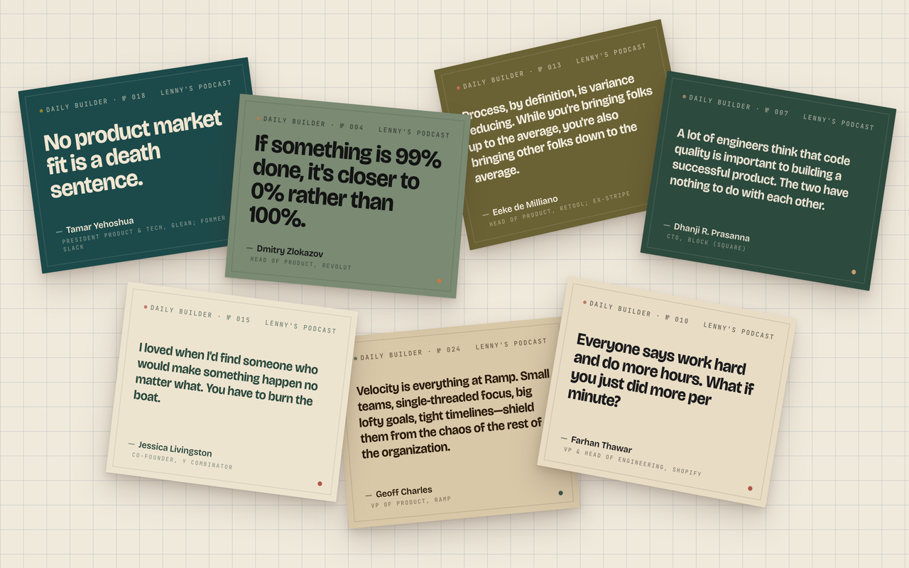

# Daily Builder Quotes

A new tab page that shows you one quote from [Lenny's Podcast](https://www.lennysnewsletter.com/podcast) every day — 365 of them, one for each day of the year.

Each poster has the quote in big type, the speaker's name and role, and a "Read summary" button that unpacks what the quote means, how the guest argues for it, and what you (as a builder) should do about it on Monday morning.

## Install

### Option 1 — Chrome / Edge / Brave extension (easiest)

1. Download or clone this repo
2. Open `chrome://extensions/`
3. Toggle **Developer mode** (top right)
4. Click **Load unpacked** and select this folder
5. Every new tab is now a daily builder quote

### Option 2 — Web page (any browser)

1. Visit the hosted version: `https://<your-username>.github.io/builder-quotes/`
2. Install a "New Tab Redirect" extension for your browser:
   - Chrome: [New Tab Redirect](https://chrome.google.com/webstore/detail/new-tab-redirect/icpgjfneehieebagbmdbhnlpiopdcmna)
   - Firefox: [New Tab Override](https://addons.mozilla.org/en-US/firefox/addon/new-tab-override/)
3. Paste the URL above into the extension's settings

### Option 3 — Local file

Just open `index.html` in your browser. Bookmark it. Done.

## Keyboard shortcuts

| Key | Action |
|---|---|
| `←` / `→` | Previous / Next quote |
| `R` or `Space` | Random quote |
| `S` | Open the summary modal |
| `ESC` | Close summary |

## Tech

- Pure HTML/CSS/JS — no build, no framework, no tracking
- 502KB total (index.html + posters.js with all 365 quotes + their unpackings)
- Auto-scaling typography for quotes from 5 to 25 words
- 30 hand-tuned color palettes cycled by index
- Stagger animation on quote entry, modal with backdrop blur

## Credits

All quotes are real guest words from [Lenny's Podcast](https://www.lennysnewsletter.com/podcast). Transcripts come from Lenny's open dataset at [LennysData.com](https://lennysdata.com/).

Each poster links to the full YouTube episode in the summary modal. This project is not affiliated with or endorsed by Lenny Rachitsky.

## License

MIT — see [LICENSE](LICENSE).
